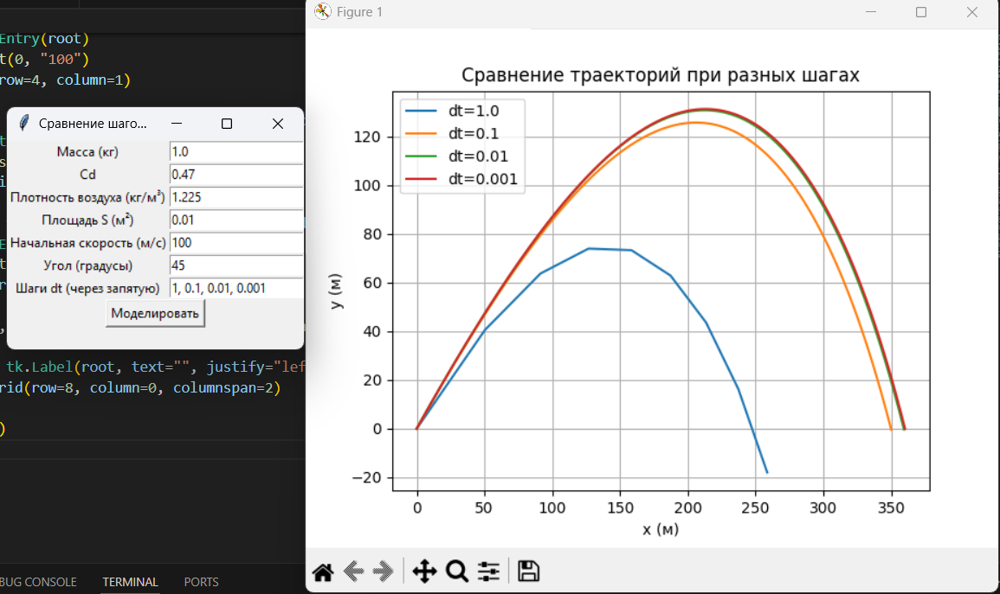
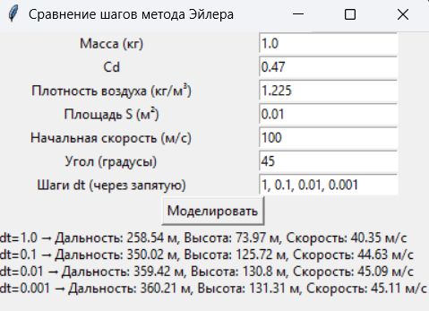

# Отчёт

## График

## Таблица результатов

## Выводы
При уменьшении шага моделирования результаты становятся более точными и устойчивыми.
При больших шагах (dt = 1) наблюдается значительное отклонение дальности и высоты полёта.
Начиная с шага 0.001 с, изменения результатов становятся незначительными, что говорит о сходимости метода Эйлера.
Следовательно, для корректного моделирования необходимо выбирать достаточно малый шаг интегрирования.