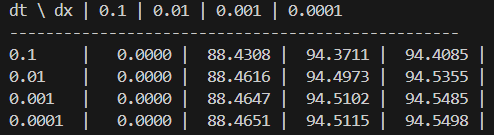

# Отчет

## Таблица
- T_слева = 0
- T_справа = 0
- T_начальное = 100
- L = 0.05 м
- t = 5 сек

## Выводы

При уменьшении шага по времени и пространству решение стабилизируется и сходится к одному значению.
При больших шагах наблюдается численная погрешность.
Неявная схема устойчива при любых шагах, но точность зависит от величины сетки.